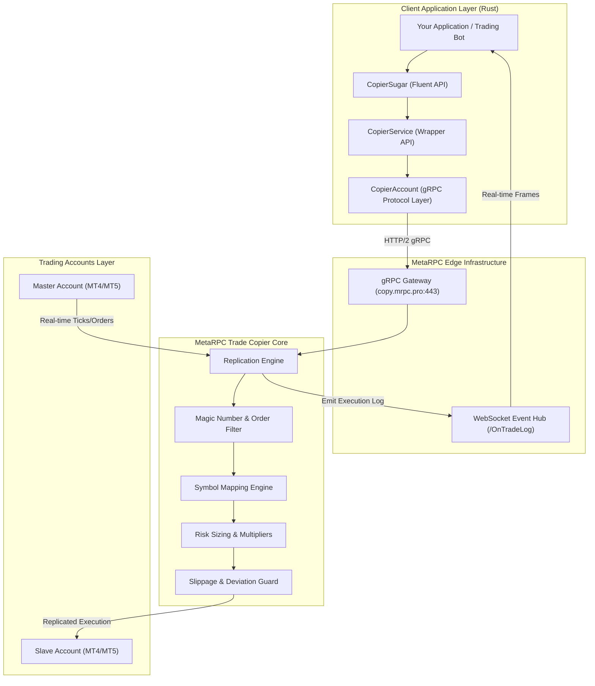

# Project Map & Architecture

This document provides a comprehensive architectural map of **RustCopier** and the MetaRPC Trade Copier engine.

---

## 1. Copier Architecture Diagram

---

## 2. Order Replication Pipeline

1. **Trade Capture**:
   - The master terminal sends order execution notifications into the MetaRPC core pipeline with zero polling overhead.
2. **Filter & Normalization**:
   - Checks if order matches magic numbers, comment filters, and symbols.
   - Applies broker symbol mapping (e.g. `XAUUSD` <-> `GOLD`).
3. **Risk & Sizing Engine**:
   - Computes target lot size using selected model (`FixedLot`, `LotMultiplier`, `BalanceMultiplier`, `FixedBalanceMultiplier`, `EquityMultiplier`).
   - Rounds to broker minimum/maximum lot steps.
4. **Execution & Slippage Protection**:
   - Verifies market price against master fill price. If slippage exceeds tolerance, execution is aborted to protect capital.
5. **Real-time Logging & Callbacks**:
   - Emits a JSON `TradeLog` frame on `/OnTradeLog?id={copierId}` and dispatches to configured Webhook URLs.
