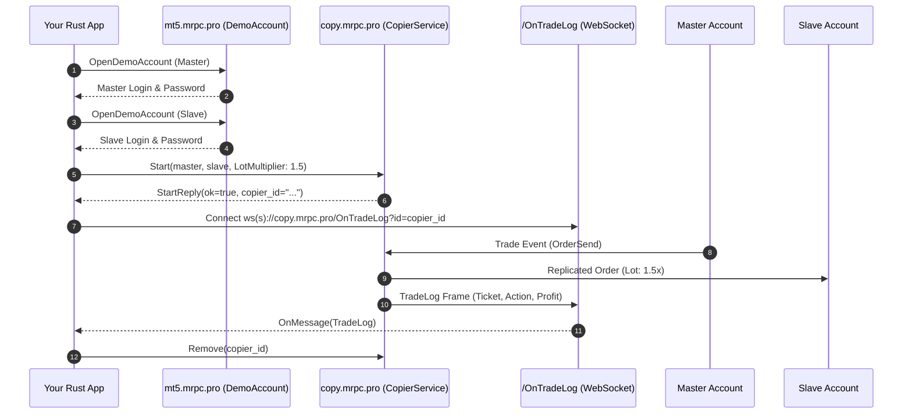

# Quick Start: Your First Project in 10 Minutes

This step-by-step tutorial walks you through building a complete trade replication application in **Rust** from scratch using **RustCopier**.

---

## 1. Overview of Steps

In this guide you will:
1. **Provision two demo MetaTrader accounts** via gRPC (`DemoAccount.OpenDemoAccount`).
2. **Connect to MetaRPC Trade Copier** over HTTP/2 gRPC (`copy.mrpc.pro:443`).
3. **Start an active copier** configured with risk multipliers and SL/TP synchronization.
4. **List all registered copiers** and inspect their state.
5. **Stream real-time trade logs** via WebSocket (`/OnTradeLog?id={copierId}`).
6. **Pause and remove** the copier cleanly.

---

## 2. Complete Runnable Code

```rust
use rustcopier::{CopierService, Account, StartRequest};

#[tokio::main]
async fn main() -> Result<(), Box<dyn std::error::Error>> {
    // 1. Initialize Copier gRPC Client
    let client = CopierService::connect("https://copy.mrpc.pro:443", "YOUR_USER_KEY", "YOUR_MANAGER_KEY").await?;

    // 2. Start Copier
    let reply = client.start(StartRequest {
        user_key: "YOUR_USER_KEY".into(),
        manager_key: "YOUR_MANAGER_KEY".into(),
        master: Account { r#type: "MT5".into(), user: 10001, password: "demoPassword1".into(), server: "MetaQuotes-Demo".into(), name: "Master".into() },
        slave: Account { r#type: "MT5".into(), user: 10002, password: "demoPassword2".into(), server: "MetaQuotes-Demo".into(), name: "Slave".into() },
        risk_type: "LotMultiplier".into(),
        risk_value: "1.5".into(),
        fixed_master_balance: "".into(),
        copy_sl: true,
        copy_tp: true,
        copy_pending_orders: true,
        reverse_copy: false,
    }).await?;

    println!("Copier created: {}", reply.copier_id);

    // 3. List Copiers
    let list = client.list().await?;
    for c in list.copiers {
        println!("Copier ID: {}, Master: {}, Slave: {}", c.id, c.master_user, c.slave_user);
    }

    // 4. Remove
    client.remove(&reply.copier_id).await?;
    Ok(())
}
```

---

## 3. How It Works Under the Hood


